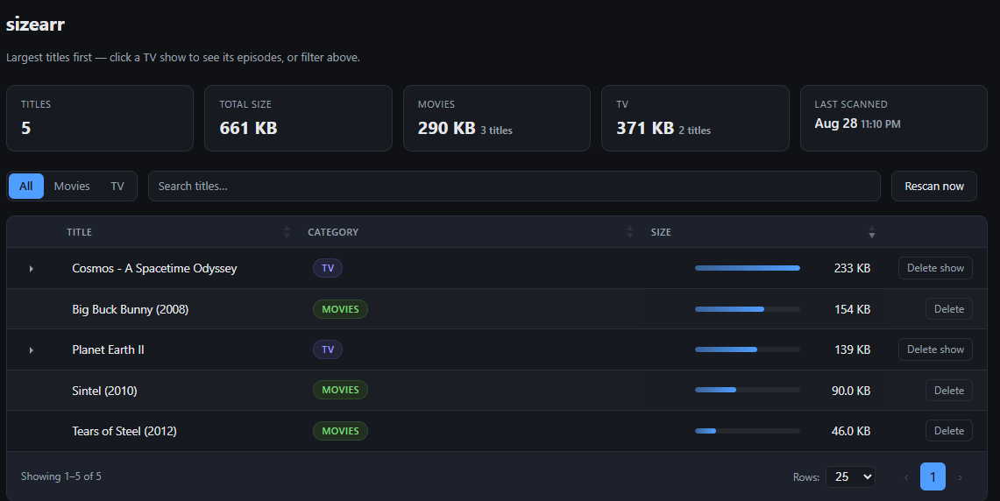
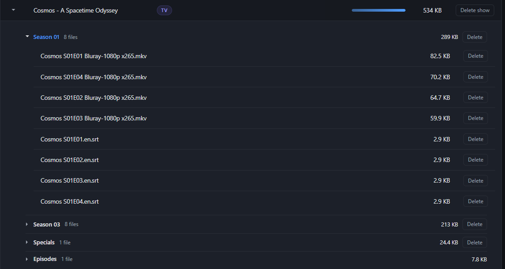
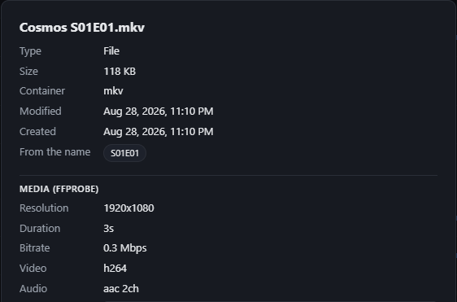
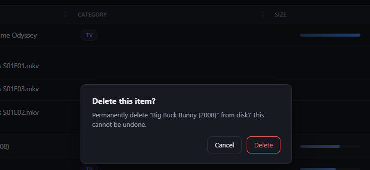

# sizearr

[](https://github.com/maxcraig112/sizearr/actions/workflows/release.yml)
[](https://hub.docker.com/r/maximiliancraig112/sizearr)
[](https://hub.docker.com/r/maximiliancraig112/sizearr)

sizearr is a lightweight companion to the *arr stack that answers one
question: **what is actually taking up all the space?** It scans your movie
and TV libraries and presents every title in a single sortable, filterable
table that lets you drill into any show, inspect a file, and delete what you
no longer want.

## Screenshots

*The whole library at a glance*



*Click a show to see its seasons, then a season to see its episodes.*



*Click any file for the details — dates, quality tags pulled from the name,
and real media info from ffprobe.*



*Deleting always asks first, and only ever touches paths inside your media
folders.*



## Installation

### Docker Compose (recommended)

Add the service to your existing stack. Point `MOVIES_PATH` / `TV_PATH` at
wherever the libraries live *inside the container* and mount your real
directories to match:

```yaml
services:
  sizearr:
    image: maximiliancraig112/sizearr:latest
    container_name: sizearr
    ports:
      - "5432:5432"
    environment:
      - MOVIES_PATH=/media/movies
      - TV_PATH=/media/tv
      - TZ=Etc/UTC
    volumes:
      # One media root containing movies/ and tv/:
      - /path/to/your/media:/media:ro
      # ...or mount the two libraries separately:
      # - /path/to/your/movies:/media/movies:ro
      # - /path/to/your/tv:/media/tv:ro
    restart: unless-stopped
```

```bash
docker compose up -d sizearr
```

Then browse to `http://<your-server-ip>:5432/`.

> **Deleting files:** the mounts above are `:ro`, which makes the app
> read-only regardless of `ENABLE_DELETE`. Drop `:ro` on the mount(s) you
> want the Delete buttons to act on.

> **`ffprobe`:** the image bundles a static `ffprobe`, so the real-media
> section of the detail popup (true resolution, bitrate, audio and subtitle
> tracks) works with no extra setup. Set `ENABLE_FFPROBE=false` to skip it,
> or point `FFPROBE` at a different binary. Running outside Docker without
> `ffprobe` on `PATH`? sizearr just falls back to reading the filename.


### Running Locally

```bash
make install       # or: pip install -r requirements.txt
make run-local     # run against the bundled testdata/ fixture library
make run           # run against MOVIES_PATH / TV_PATH from the environment

# point it at a real library
MOVIES_PATH=/data/movies TV_PATH=/data/tv make run
```

`make run-local` uses `testdata/` — a small library of empty placeholder
files (see [`testdata/README.md`](testdata/README.md)) so you can see the UI
without a real media library.

## Configuration

All configuration is via environment variables.

| Variable                  | Default         | Description                                                        |
|---------------------------|-----------------|--------------------------------------------------------------------|
| `MOVIES_PATH`             | `/media/movies` | Directory scanned for movie titles                                |
| `TV_PATH`                 | `/media/tv`     | Directory scanned for TV titles                                   |
| `PORT`                    | `5432`          | Port the web server listens on                                    |
| `REFRESH_INTERVAL_SECONDS`| `3600`          | How often to automatically rescan, in seconds                     |
| `LOG_LEVEL`               | `INFO`          | `DEBUG` adds a log line per title with its measured size          |
| `ENABLE_DELETE`           | `true`          | `false` hides the Delete buttons and rejects `POST /api/delete`   |
| `ENABLE_FFPROBE`          | `true`          | `false` skips `ffprobe` even when it is installed                 |
| `FFPROBE`                 | `ffprobe`       | Path to the `ffprobe` binary                                     |

## How it works

* Each top-level folder inside `MOVIES_PATH` / `TV_PATH` is one title. Its
  size is the sum of the media files under it. Artwork, `.nfo` and other
  non-media files are skipped so the totals reflect what the video actually
  costs.
* Results are cached in memory and refreshed on the timer, on the *Rescan
  now* button, and immediately after a delete.
* `ffprobe` is only ever run on the single file you click — never during the
  bulk scan — with a 20-second timeout.
* Deletes resolve the target with `realpath` and reject anything that is not
  strictly inside a media root (`..`, symlink escapes, the root itself). The
  request returns straight away and the disk delete happens in the
  background, so removing a big folder doesn't hang the browser.

## HTTP API

| Method & path       | Purpose                                                    |
|---------------------|------------------------------------------------------------|
| `GET /api/media`    | Cached scan results, totals, scan status, feature flags   |
| `GET /api/detail`   | Detail for one title or file (`category`, `name`, `child`)|
| `POST /api/rescan`  | Trigger a background rescan                                |
| `POST /api/delete`  | Delete a title or file (`category`, `name`, `child`)      |

## Repository layout

```
.
├── app.py                    # Entrypoint - starts sizearr.web
├── sizearr/                  # The app, split by concern:
│   ├── config.py             #   env vars + logging, all in one place
│   ├── fsutil.py             #   walking the media tree
│   ├── scanner.py            #   folders -> the flat list of titles
│   ├── cache.py              #   in-memory index of the last scan + refresh loop
│   ├── paths.py              #   validating a request into a path inside a root
│   ├── naming.py             #   quality tags + media/non-media extensions
│   ├── ffprobe.py            #   optional real media metadata
│   ├── detail.py             #   the per-item detail payload
│   └── web.py                #   Flask app and routes
├── templates/
│   └── index.html            # Page markup only
├── static/
│   ├── css/                  # base / layout / components / table
│   ├── js/app.js             # Fetches the API and renders the table
│   └── vendor/               # Bundled jQuery + DataTables (no CDN)
├── testdata/                 # Placeholder library for `make run-local`
├── images/                   # Screenshots used in this README
├── Dockerfile
├── Makefile                  # make install / run / run-local
├── requirements.txt
└── .github/workflows/release.yml
```
